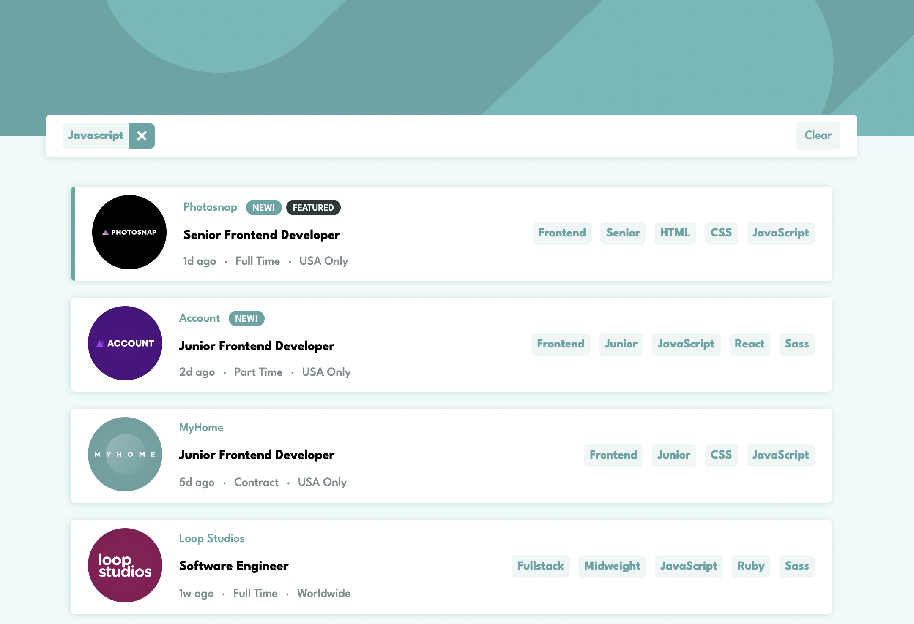

# JOB Listings Web App 

## Welcome / Bem vindo!

Thanks for checking out my front-end project. 
🇧🇷/🇵🇹 *Obrigado por conferir meu projeto de front-end.*

## Overview

This app allows the user to navigate and filter job listings based on the available categories. 
*Este aplicativo permite que o usuário navegue e filtre anúncios de emprego com base nas categorias disponíveis.*

## Built with

- HTML5;
- CSS3;
- Java Script (Vanilla JS);
- Mobile-first workflow;

## Features

- Supports **JSON data** file.
- **Dinamic HTML** injected by JavaScript.
- Filter algorithm with JavaScript.
- Responsive design: support both desktop and mobile displays.
- CSS layout with flexbox.

## Links

- App URL (Deploy): [https://wseguchi.github.io/job-listings-webapp/](https://wseguchi.github.io/job-listings-webapp/)
- Github Repository: [https://github.com/wseguchi/job-listings-webapp](https://github.com/wseguchi/job-listings-webapp)

## Author

- Wildson Seguchi
- [Github](https://github.com/wseguchi)
- [LinkedIn](https://www.linkedin.com/in/wildson-seguchi-a61325180/)

### Frontend Mentor Challenge

This is a solution to the [Job listings with filtering challenge on Frontend Mentor.](https://www.frontendmentor.io/challenges/job-listings-with-filtering-ivstIPCt).